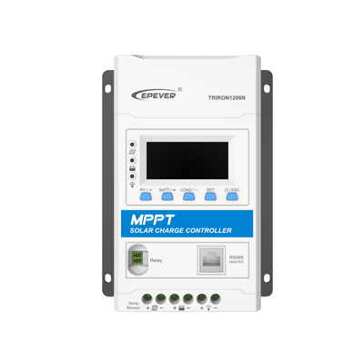
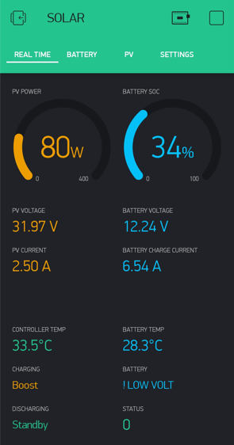
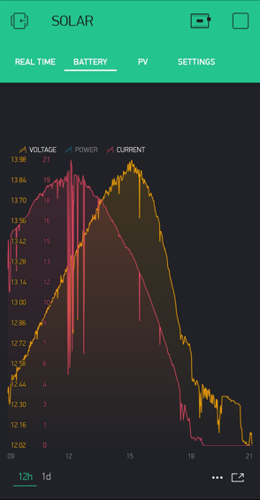
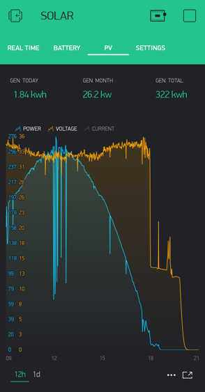
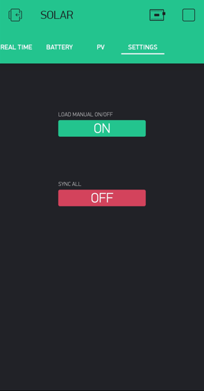

# Solar-tracer-Blynk-V3 

### An Arduino project to connect one MPPT Solar Controllers to an `ESP8266/ESP32` and monitor it!

You can take a look to the previous version of this software:
* *v1* [Tracer-RS485-Modbus-Blynk](https://github.com/jaminNZx/Tracer-RS485-Modbus-Blynk)
* *v2* [Tracer-RS485-Modbus-Blynk-V2](https://github.com/tekk/Tracer-RS485-Modbus-Blynk-V2)

What you got with v3:
1. **lots of data** from you solar controller (temps, charging/discharging/battery status, stats ... and more)
2. wide range of **customization** using a single file (*config.h*)
3. automatic **time sync** between the ESP and the controller on each boot, using NTP time
4. **platformio** support
5. **ESP32** support
6. **Configuration over wifi**, no needs to compile the code (if you don't want to)
7. ready for future expansion (more solar charge controllers with different communication protocol/channel)

Feel free to make pull requests if you wish to help improving.
There is also a support forum on the Blynk community forums: http://community.blynk.cc/t/epsolar-tracer-2210a-charge-controller-blynk-epic-solar-monitor/10596

You are welcome for suggestions, bugreports, and of course any further improvements of this code.

## Solar Controller Supported

## Sample screenshot

## Tutorial
Supported board:
- [ESP8266](docs/esp8266.md)
- [ESP32](docs/esp32.md)

Available sync. options:
- [Blynk legacy](docs/sw_getting_started_blynk_legacy.md)
- [Blynk 2.0]()
- [Home assistant-MQTT](docs/sw_getting_started_ha.md)
- [MQTT](docs/sw_getting_started_mqtt.md)

Some examples:
- [ESP8266 + MAX485 +  EPEVER Solar Tracer](docs/Esp8266_max485_epever_rj45.md)
- [ESP32 + MAX485 +  EPEVER Solar Tracer](docs/Esp32_max485_epever_rj45.md)

## Credits

- `@jaminNZx:`
	- Thanks to subtafuge on [Reddit](https://www.reddit.com/r/esp8266/comments/59dt00/using_esp8266_to_connect_rs485_modbus_protocol/) for lending me his working Tracer RS485 code! 

- `@tekk:`
	- Feel free to contact me about my code changes in this version 
	- Thanks to [@jaminNZx](https://github.com/jaminNZx) for the original code. Big up!

- `@bettapro:`
	- Thanks to [@tekk](https://github.com/tekk) for his work. Big up!
	- Feel free to contact me about my code changes in this version
