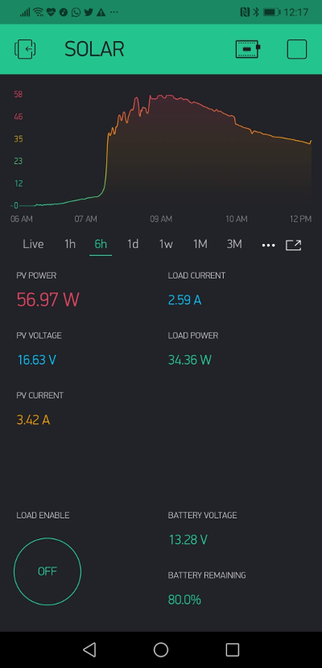

# Solar-tracer-Blynk-V3 

### An Arduino project to connect one MPPT Solar Controllers to an `ESP8266/ESP32` and monitor it using the `Blynk` mobile app!

You can take a look to the previous version of this software:
* *v1* [Tracer-RS485-Modbus-Blynk](https://github.com/jaminNZx/Tracer-RS485-Modbus-Blynk)
* *v2* [Tracer-RS485-Modbus-Blynk-V2](https://github.com/tekk/Tracer-RS485-Modbus-Blynk-V2)

What you got with v3:
1. **lots of data** from you solar controller (temps, charging/discharging/battery status, stats ... and more)
2. wide range of **customization** using a single file (*config.h*)
3. automatic **time sync** between the ESP and the controller on each boot, using NTP time
4. **platformio** support
5. **ESP32** support
6. possibility for future expansion (more solar charge controllers with different communication protocol/channel)

Feel free to make pull requests if you wish to help improving.
There is also a support forum on the Blynk community forums: http://community.blynk.cc/t/epsolar-tracer-2210a-charge-controller-blynk-epic-solar-monitor/10596

## Solar Controller Supported

## Sample screenshot

## V3

## V2

## Software required

* [Blynk](http://www.blynk.cc/) Mobile App ([iOS](https://itunes.apple.com/us/app/blynk-iot-for-arduino-rpi/id808760481?mt=8) & [Android](https://play.google.com/store/apps/details?id=cc.blynk&hl=en))
* Arduino IDE 1.6.9+ or Platformio (visual studio code)
* This project

## Setup

### Libraries [Arduino IDE only]

Follow links to get them.

* [Blynk Library](https://github.com/blynkkk/blynk-library)
* [ArduinoOTA](https://github.com/esp8266/Arduino/tree/master/libraries/ArduinoOTA)
* [SimpleTimer](https://github.com/schinken/SimpleTimer)
* [ModbusMaster](https://github.com/4-20ma/ModbusMaster) - requires my ModbusMaster fork, available [here](https://github.com/Bettapro/ModbusMaster) 

## Tutorial

Refer to [Sw_getting_started.md](docs/Sw_getting_started.md) 

Some details:
- ESP8266 + MAX485 +  EPEVER Solar Tracer [HOW TO](docs/Esp8266_max485_epever_rj45.md)
- ESP32 + MAX485 +  EPEVER Solar Tracer [HOW TO](docs/Esp32_max485_epever_rj45.md)

## Reference

* [Tracer A/B Series MPPT Solar Controller - Modbus Protocol](images/1733_modbus_protocol.pdf)

## Developing further

> I plan to add a default configs to make the setup easier
> I'd make the values optional (you can choose the values to monitor)
> I'd use external current sensor to measure high current absorption

You are welcome for suggestions, bugreports, and of course any further improvements of this code.

## Credits

- `@jaminNZx:`
	- Thanks to subtafuge on [Reddit](https://www.reddit.com/r/esp8266/comments/59dt00/using_esp8266_to_connect_rs485_modbus_protocol/) for lending me his working Tracer RS485 code! 

- `@tekk:`
	- Feel free to contact me about my code changes in this version 
	- Thanks to [@jaminNZx](https://github.com/jaminNZx) for the original code. Big up!

- `@bettapro:`
	- Thanks to [@tekk](https://github.com/tekk) for his work. Big up!
	- Feel free to contact me about my code changes in this version
