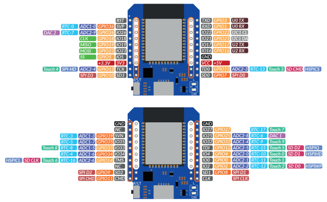
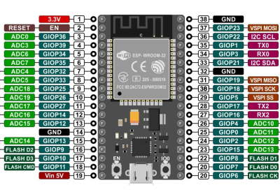

# Connect  ESP32 to EPEVER A/B Series ( + MAX485) 

Here the material involved:
* ESP 32 MODULE, below the modules tested:
	* [ESP32 D1 MINI](https://www.aliexpress.com/premium/esp32-d1-mini.html?d=y&origin=y&catId=0&initiative_id=SB_20210919083440&SearchText=esp32%20d1%20mini) 
	* [ESP32 WROOM DEV MODULE](https://it.aliexpress.com/wholesale?catId=0&initiative_id=SB_20210919092741&isPremium=y&SearchText=esp+wroom-32+38+pin+devkit) 
	* or any esp32 module you like
* [EPSolar/EPEver Tracer A/B-Series](https://www.aliexpress.com/wholesale?catId=0&initiative_id=SB_20170114172728&SearchText=tracer+mppt+rs485)
* [MAX 485 UART Module](https://www.aliexpress.com/wholesale?catId=0&initiative_id=SB_20210919083609&isPremium=y&SearchText=max485+module) 
* An old ethernet cable with RJ45 connector you are happy to cut open

## ESP32 <-> MAX485 module

It's powered from `+5V` from ESP32 module, and wired as following:

### ESP32 D1 MINI
- `DI` -> `IO17` / `GPIO17` / `TX2`
- `RO` -> `IO16` / `GPIO16` / `RX2`
- `DE` and `RE` are interconnected with a jumper and then connected to pin  `TCK` / `GPIO13`
- `VCC` to `+3.3V` / `3V3` on ESP32

	

### ESP32 WRROOM 38 PIN
- `DI` -> `28` / `GPIO17` / `TX2`
- `RO` -> `27` / `GPIO16` / `RX2`
- `DE` and `RE` are interconnected with a jumper and then connected to pin  `15` / `GPIO13`
- `VCC` to `+3.3V` / `3.3v` on ESP32

## MAX485 module <-> EPEVER CONTROLLER (RJ45)

Cut open your ethernet cable and split out pin 4, 6, 8 (B, A, GND). Refer to [Tracer Modbus PDF](../docs/1733_modbus_protocol.pdf) for additional info.

Connect cables as follows (make sure you wire matches the color schema below - otherwise refer to pin numbers only):
- Ethernet green / pin `6` -> `A`
- Ethernet blue / pin `4` -> `B`
- Ethernet brown / pin `8` -> `GND` on module **and** ESP8266 `GND` pin
		- -> to prevent ground loops - **important!**
- **DON' T** use pin `1` or `2` to feed the ESP8266 (they supply 7,5/5V - 50mA maximum)

## BASE SW CONFIGURATION

Edits required on *src/config.h*:
- `#define BOARD_ST_SERIAL_STREAM Serial2` [default]
- Uncomment `#define USE_SERIAL_MAX485`
- `#define MAX485_DE 13`
- `#define MAX485_RE_NEG 13`

Edit on *platformio.ini* (Platformio only):
- **ESP32 MINI D1 - only**
	- `platformio.default_envs = wemos_d1_mini32` (usb/serial fw flash) or `platformio.default_envs = wemos_d1_mini32_ota` (ota fw flash)
- **ESP32 DEV MODULE - only**
	- `platformio.default_envs = esp32dev` (usb/serial fw flash) or `platformio.default_envs = esp32dev_ota` (ota fw flash)

You may need to make more changes according to your needs (ntp syn/led status/ data to monitor ...).

