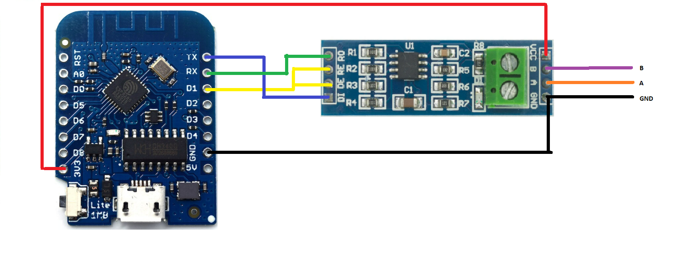
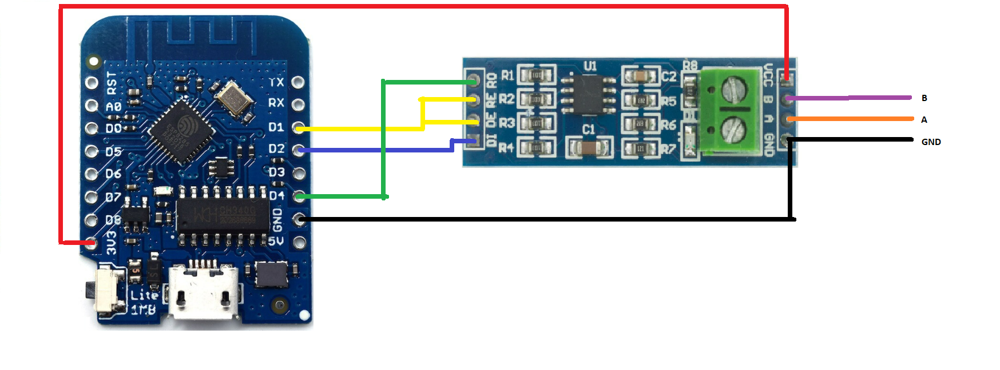
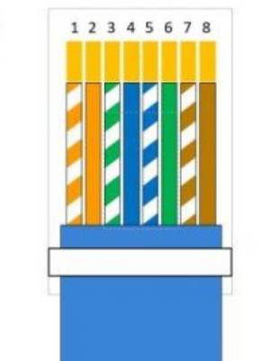

# Connect  ESP8266  to EPEVER A/B Series ( + MAX485) 

Here the material involved:
* [ESP8266 Dev Board](https://www.aliexpress.com/wholesale?catId=0&initiative_id=SB_20170114172938&SearchText=esp8266+mini)
* [EPSolar/EPEver Tracer A/B-Series](https://www.aliexpress.com/wholesale?catId=0&initiative_id=SB_20170114172728&SearchText=tracer+mppt+rs485)
* [RS485 UART Module](https://www.aliexpress.com/wholesale?catId=0&initiative_id=SB_20170114172807&SearchText=uart+rs485) (~~not the MAX485 chip!~~ - `@tekk:` I'm using [MAX485 cheapo module](../images/max485_module.jpg) and it works fine!)
* An old ethernet cable with RJ45 connector you are happy to cut open

## ESP8266 <-> MAX485 module

Required connections:
- `DI` -> `D10` / `GPIO1` / `TX`
- `RO` -> `D9` / `GPIO3` / `RX`
- `DE` and `RE` are interconnected with a jumper and then connected to pin `D1` / `GPIO5`
- `VCC` to `3.3V` on ESP8266

	

## ESP8266 <-> MAX485 module + SOFTWARE SERIAL (since v3.0.7)

Required connections:
- `DI` -> `D3` / `GPIO1`
- `RO` -> `D4` / `GPIO2`
- `DE` and `RE` are interconnected with a jumper and then connected to pin `D1` / `GPIO5`
- `VCC` to `3.3V` on ESP8266

## MAX485 module <-> EPEVER CONTROLLER (RJ45)

Cut open your ethernet cable and split out pin 4, 6, 8 (B, A, GND). Refer to [Tracer Modbus PDF](../docs/1733_modbus_protocol.pdf) for additional info.

Connect cables as follows (make sure you wire matches the color schema below - otherwise refer to pin numbers only):
- Ethernet green / pin `6` -> `A`
- Ethernet blue / pin `4` -> `B`
- Ethernet brown / pin `8` -> `GND` on module **and** ESP8266 `GND` pin
		- -> to prevent ground loops - **important!**
- **DON' T** use pin `1` or `2` to feed the ESP8266 (they supply 7,5/5V - 50mA maximum)

