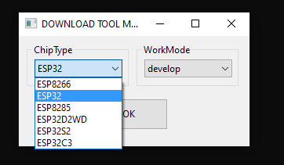

# SW getting started

## 1a. Flash a pre-built firmware
Download the most recent version of the firmware https://github.com/Bettapro/Solar-Tracer-Blynk-V3/releases .

Download the correct bif file depending on the board you're gonna use:
 - SolarTracerBlynk_3.x.x_esp32dev_FULL.bin - full bin file to use on a ESP32 (it includes all the bin needed eg: bootloader, firmware ...), use it on the very first setup.
 - SolarTracerBlynk_3.x.x_esp8266.bin - bin file to use on a ESP8266.

 Download [esp_flash_download_tool](https://www.espressif.com/en/support/download/other-tools).

 Start esp_flash_download_tool and select the correct board

 Load the bin downloaded, set the address to 0x0000, and press START.

**You board is ready!**

## 1b. Build manually
Download the most recent version of this project https://github.com/Bettapro/Solar-Tracer-Blynk-V3/releases

Open you favorite IDE:
 - Arduino IDE:  open *SolarTracerBlynk* folder, then open *SolarTracerBlynk.ino* .
 - Platformio: import the project using *platformio.ini* .

### Libraries to include in Arduino IDE

* [Blynk Library](https://github.com/blynkkk/blynk-library)
* [ArduinoOTA](https://github.com/esp8266/Arduino/tree/master/libraries/ArduinoOTA)
* [SimpleTimer](https://github.com/schinken/SimpleTimer)
* [ModbusMaster_obj](https://github.com/Bettapro/ModbusMaster) 
* [WiFiManager](https://github.com/tzapu/WiFiManager) 
* [ArduinoJson](https://github.com/bblanchon/ArduinoJson) 

### Edit `config.h` library
Open `SolarTracerBlynk\config.h`

* Enter your WiFi credentials in `WIFI_SSID` and `WIFI_PASS`.
* Send yourself the generated auth code from the mobile app
* Paste your auth code into `BLYNK_AUTH`

You can customize further more modifying config.h (eg. status LED, ntp time sync, blynk serve ...), each option is documented on the config.h file.
Please refer to the notes written on it.

### Upload firmware

Upload the sketch to your ESP8266 / ESP32, if you are using platformio you should edit `default_envs` accordingly (eg: *esp8266* to use a esp8266, *esp8266_ota* to update ESP8266 via OTA, *esp32dev* to use and ESP32, .... )

**You board is ready!**

## 2. Mobile App

 Get the Mobile App ([iOS](https://itunes.apple.com/us/app/blynk-iot-for-arduino-rpi/id808760481?mt=8) & [Android](https://play.google.com/store/apps/details?id=cc.blynk&hl=en))

Open the Blynk mobile app and create a new project by scanning the following QR code

### Legacy app (v3) - SUGGESTED
Current version of the app, complete overview of the solar charge controller.

### Legacy app (v2)
Original version of the mobile app, shows a small set of data.

Click PLAY on you mobile app, you should start receiving updates from your solar tracer!.

## 3. Wifi Configuration (SETUP MODE)

You can configure your board via a web interface.

Device will try to connect to your wifi network, if the connection fails, it will turn to AP mode and create a new wifi network.
You can trigger the setup mode by putting in HIGH status (3.3v) pin 19 for few seconds(default value, check your config.h) just after you pressed the reset button.

**NOTE:** ESP32 could switch to this mode using the hall sensor, just press the reset button and keep a magnet close to the board (please make sure this feature is enabled in your firmware)

Default values:
 - WIFI SSID: SolarTracerAP
 - WIFI PASSWORD: admin1234

Connect to this Wifi network, then oper a browser and go to http://192.168.4.1 .

 

Click on Configure and fill the form with your data.

 

## 4.Update
You can update your board just by compiling and flashing the new firmware as explained in point **1b** .

Otherwise, you should trigger the setup mode manually and you the UPDATE button.

Download the most recent version of the firmware https://github.com/Bettapro/Solar-Tracer-Blynk-V3/releases .
- SolarTracerBlynk_3.x.x_esp32dev.bin - ESP32 only
- SolarTracerBlynk_3.x.x_esp8266.bin - ESP8266 only

Load the bin file into the form shown and press update.

