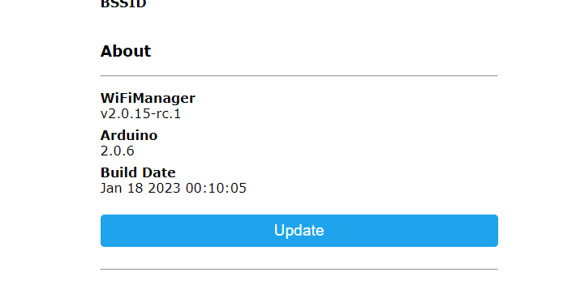

# ESP32

## HOW TO FLASH

You need:
- one bin file, the firmware you want to install on your ESP32
- [esp flasher tool](https://www.espressif.com/en/support/download/other-tools)

**NOTE:** The board has to be prepared the first time you use it, by flashing a particular bin file as described [below](#first-time-setup). This has to be done only once, then, you can install the firmware via [COM](#com-firmware-upgrade) or [WEB](#wifi-firmware-upgrade).

---
### First time setup

The very first time you procees with the firmware flash, you must prepare your board with one addiotional step.  

You need one additional bin file the first time you flash this firmare, you can download it [here](https://github.com/Bettapro/Solar-Tracer-Blynk-V3/releases/download/v3.0.4/SolarTracerBlynk_3.0.4_esp32dev_FULL.bin)
This bin file contains a complete image of the flash memory.

Start esp_flash_download_tool and select the correct board (ESP32):  

Load the bin "SolarTracerBlynk_3.0.4_esp32dev_FULL.bin", set the address to 0x0000.  

Select the correct COM port and then press START, it should take some time the complete the process.  
Reboot board, you should see a new access point named "Solar tracer", if so, you are ready to upgrade to the REAL firmware.

---
### COM firmware upgrade
You will upgrade your firmware using the COM serial port.  

Start esp_flash_download_tool and select the correct board (ESP32):  

Load the bin set the address to 0x10000.  

Select the correct COM port and then press START, it should take some time the complete the process.  
Reboot board, upgrade completed!

---
### WIFI firmware upgrade
You will upgrade your firmware using the web interface.

Start your ESP32 in configuration mode, the board will create an access point (normally named "Solar tracer").  

Connect to the AP, open a new tab on your web browser and go to http://192.168.4.1 .  

Click INFO.  

Click UPDATE.  

Load the bin file and start the update.  

Reboot board, upgrade completed!