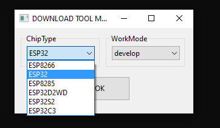
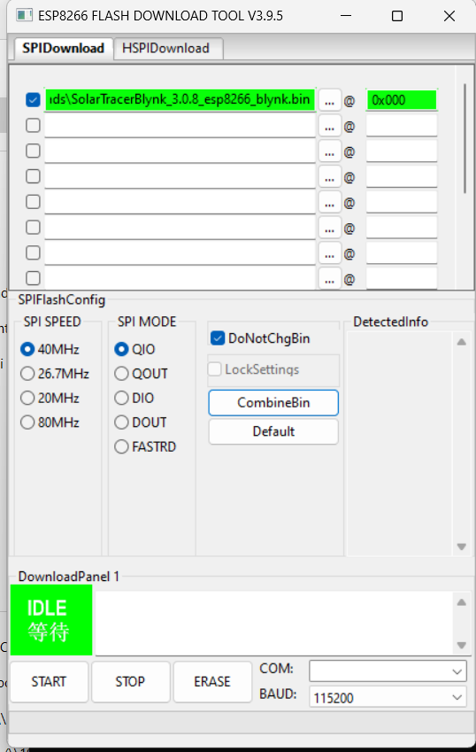
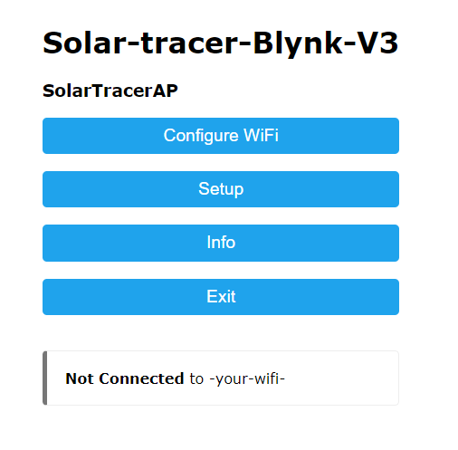
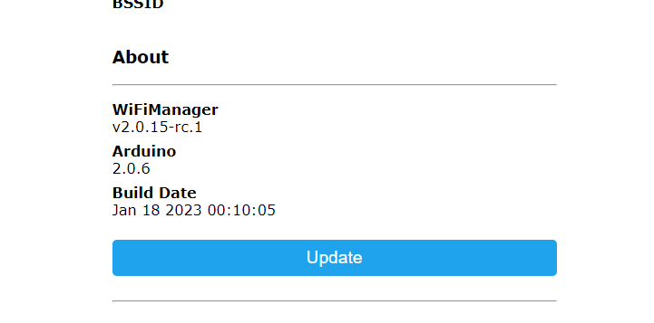
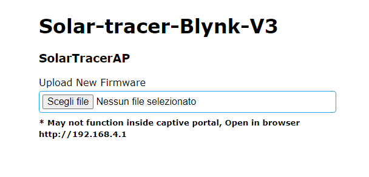

# ESP8266

## HOW TO FLASH

You need:
- one bin file, the firmware you want to install on your ESP8266
- [esp flasher tool](https://www.espressif.com/en/support/download/other-tools)

---
### COM firmware upgrade
You will upgrade your firmware using the COM serial port.  

Start esp_flash_download_tool and select the correct board (ESP8266):  

Load the bin set the address to 0x0.  

Select the correct COM port and then press START, it should take some time the complete the process.  
Reboot board, upgrade completed!

---
### WIFI firmware upgrade
You will upgrade your firmware using the web interface.

Start your ESP8266 in configuration mode, the board will create an access point (normally named "Solar tracer").  

Connect to the AP, open a new tab on your web browser and go to http://192.168.4.1 .  

Click INFO.  

Click UPDATE.  

Load the bin file and start the update.  

Reboot board, upgrade completed!