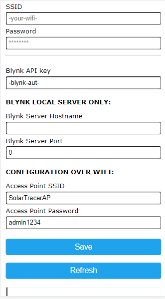

# SW getting started Blynk LEGACY

*!This sync should be consider as deprecated, as blynk IOT replaced it, you must have a working blynk (local) server!*

Download the latest version of this firmware from [here](https://github.com/Bettapro/Solar-Tracer-Blynk-V3/releases/latest).  
Choose the correct bin file according to your board (esp8266, esp32):
- *SolarTracerBlynk_xxxx_esp32dev_blynk.bin*: ESP32 only
- *SolarTracerBlynk_xxxx_esp8266_blynk.bin*: ESP8266 only

Flash the firmware on your EPS8266/ESP32, more information how to flash firmware are available [ESP32](esp32.md#how-to-flash) [ESP8266](esp8266.md#how-to-flash)

## Mobile App

Get the Mobile App ([Android](https://www.apkmirror.com/apk/blynk-inc/blynk-legacy/blynk-legacy-2-27-34-release/blynk-legacy-2-27-34-android-apk-download/))

Open the Blynk mobile app and create a new project by scanning one of the following QR code.

### Legacy app (v3) - SUGGESTED
Current version of the app, complete overview of the solar charge controller. ENERGY REQUIRED: 14300

### Legacy app (v2)
Original version of the mobile app, shows a small set of data. ENERGY REQUIRED: 4400

## Back to ESP board

Boot the ESP in Configuration mode and double check all the settings, double check the mqtt section and make sure that mqtt settings are correct.  

Thats all! your mobile app will get updated with the data from your SCC.

