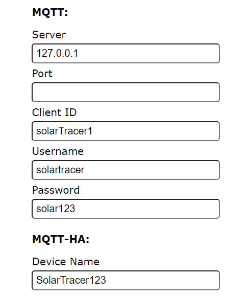

# SW getting started Home Assistant

*!You must have a working mqtt broker and also the mqtt integration in you home assistant integration!*

Download the latest version of this firmware from [here](https://github.com/Bettapro/Solar-Tracer-Blynk-V3/releases/latest).  
Choose the correct bin file according to your board (esp8266, esp32):
- *SolarTracerBlynk_xxxx_esp32dev_mqttHA.bin*: ESP32 only
- *SolarTracerBlynk_xxxx_esp8266_mqttHA.bin*: ESP8266 only

Flash the firmware on your EPS8266/ESP32, more information how to flash firmware are available [ESP32](esp32.md#how-to-flash) [ESP8266](esp8266.md#how-to-flash)

Boot the ESP in Configuration mode and double check all the settings, double check the mqtt section and make sure that settings are correct.
 

Connection to MQTT broker could fail with error, the error code will be reported in the serial log, here the full error code list:
- **-4** connection timeout
- **-3** connection lost
- **-2** connection failed
- **-1** disconnected
- **1** bad protocol
- **2** bad client id
- **3** unavailable
- **4** bad credentials
- **5** unauthorized

If everything is working your mqtt integration will discover and configure the solar tracer.  

You can now proceed and display all the data you need on your widgets (and even on the Energy monitoring page!)

