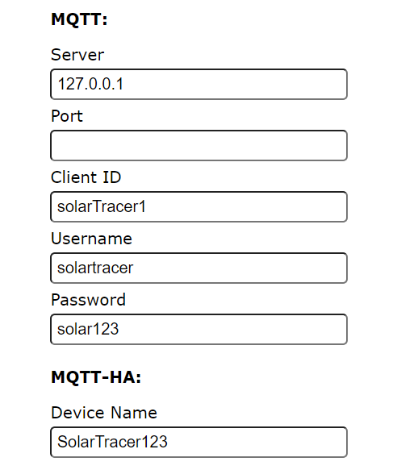

# SW getting started MQTT

*!You must have a working mqtt broker!*

Download the latest version of this firmware from [here](https://github.com/Bettapro/Solar-Tracer-Blynk-V3/releases/latest).  
Choose the correct bin file according to your board (esp8266, esp32):
- *SolarTracerBlynk_xxxx_esp32dev_mqtt.bin*: ESP32 only
- *SolarTracerBlynk_xxxx_esp8266_mqtt.bin*: ESP8266 only

Flash the firmware on your EPS8266/ESP32, more information how to flash firmware are available [ESP32](esp32.md#how-to-flash) [ESP8266](esp8266.md#how-to-flash)

Boot the ESP in Configuration mode and double check all the settings, double check the MQTT section and make sure that settings are correct.
  

On you MQTT broker you will find a new main topic named *solarTracer/values/* containing a topic for each value for your controller.

